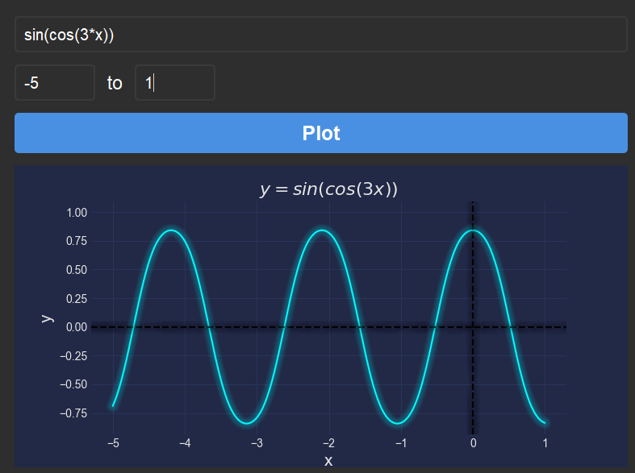

# Graphing Calculator Python

Simple Graphing calculator written in python with pyside2 and matplotlib

## Supported Functions:

- "+"

- "-"

- "*"

- "/"

- "^"

- ln

- log2

- log10

- sin

- cos

- tan

- sqrt

## What will not work:

| Don't     | DO         |
|:---------:|:----------:|
| 3x        | 3*x        |
| sinx      | sin(x)     |
| ln(sin(x) | ln(sin(x)) |

Both upper and lower case will work
